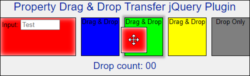

Style Property Drag and Drop
============================

## jQuery plugin that provides:

* Transfer of a CSS property (e.g. background-color) from one element to another.
* Operation with mouse, stylus, and touch events.
* A clone to show the transfer.
* Finding a destination node, even when that node is a parent node (the parent is covered by a child node, such as an input box).
&nbsp;  

## Demos
[Simple demo](http://richdebourke.github.io/style-property-drag-and-drop/index.html) — example of the plugin functionality

[In operation](http://goo.gl/4Huz36) — plugin in use on a website

## Dependencies
jQuery 2.X or 3.X — The plugin works with the slim build version of jQuery 3.X.

## Browser compatibility
The plugin only supports newer browsers including Internet Explorer from version 9 – it does not support IE8 or older.

## Usage

Include the plugin CSS (either as a file in the head section or incorporated into the page's CSS):

~~~~ html
<link href="property-drag-drop.css" rel="stylesheet">
~~~~

Add jQuery, the plugin, and the JavaScript code to initiate the plugin and process the change:

~~~~ javascript

~~~~

The demo uses the `handleDropEvent function` to demonstrate how to use the drop information by counting the number of times a background color was transferred.

### Source (draggable) elements
Any element on the page that has the assigned source class can be a source. In the example, the assigned source class is `draggable`.

### Destination (droppable) elements

Any element on the page that has the assigned destination class can be a destination. In the example, the assigned destination class is `droppable`.

## Configuring the plugin

The plugin accepts the following parameters when it is initialized:

* **transferProperty** — Required – CSS property to be transferred – default is backgroundColor
    * *The property can be specified in either CSS or DOM formatting (e.g. background-color or backgroundColor).*
* **dropTargetClass** — Required – elements with this class are destination elements.
* **sourceHighlightClass** — Optional – class to apply to the source element when dragging a clone of the source element.
    * *This class has limited value as the user probably will not require any indication for what was the source element.* 
* **cloneClass** — Required – class that defines the clones.
* **cloneWidth** — Optional – width of the clone in pixels – default value is 48 pixels.
* **cloneHight** — Optional – height of the clone in pixels – default value is 48 pixels.
* **cloneCanDropClass** — Optional – class to apply to the clone when dropping is possible.
* **destinationCanReceiveClass** — Optional – class to apply to the destination element when the clone is in range for a drop.
    * *Just the cloneCanDropClass or the destinationCanReceive class is enough to indicate to the user that the clone can be dropped. Using both on the same page would be redundant.*
* **bodyDraggingClass** — Required – adds a class to the body to maintain the cursor style.
* **didDrop** — Callback function that's called after the clone is dropped onto a target. The function is provided with jQuery objects for the source (\$src) and destination (\$dst). The default is to transfer the background color. *Use an external callback function to transfer the CSS property and to do something with that change.*
* **childrenIgnore** — Optional – a CSS selector string that is used to ignore child components for selecting a draggable element.

## How the plugin works
This plugin is a fork of Mikael Plate's [jquery-drag-drop-plugin](https://github.com/mikeplate/jquery-drag-drop-plugin) with modifications.

The modifications include:
* Removed the canDrag & canDrop callbacks and the destroy, on, and off methods
* Creating a clone is standard (not an option)
* Removed the option for restricting dragging to within a container
* Switched from jQuery .bind/.unbind to JavaScript add/removeEventListener
* Added a loop to check whether a parent element has the dropTargetClass
    * *For my application, I needed to identify if a parent element was a potential destination element. As a clone is being moved, I use the move event to identify the element that is under the mouse or touch point (elementFromPoint). I then check that element and its parents to see if any element has the dropTargetClass. If I find a parent with the class, the parent is set as the possible destination.*
* Changed the positioning logic

The plugin adds a listener to the source elements. At a touchstart or mousedown event on a source element, a clone with the required source property is created. The clone can be dragged to a destination element. If the clone is released over a destination element, the designated property is transferred to the destination element.

## Revisions

#### 2021/01/01 — Version 2.0

Added a parameter for identifying child elements where propagation should be stopped when entered. Previous versions did that external to the plugin.

The clone height and width are now provided via a parameter. Previously they were part of the CSS styling.

Now using JavaScript `addEventListener` for pointer events (to support mouse, touch, and stylus) for most browsers and mouse events for IE 9 & 10, which don't support pointer events.

#### 2020/07/05

Validated to work with jQuery 3.5.1.

#### 2019/05/10

Validated to work with jQuery 3.4.1.

#### 2016/05/29 — Version 1.1
My first version used clientX/Y for touch and pageX/Y for mouse events, and adjusted the values using the scroll offset values (this is the way the  source plugin I forked worked).

The problem is Chrome for Android sometimes references the top left of the document (instead of the viewport) for both clientX/Y and elementFromPoint.

To work around the problem, I changed the logic so that the clone position is always based on pageX/Y values and the elementFromPoint is always based on clientX/Y values.

*This change works as Chrome on Android uses the same clientX/Y values for touch positions and elementFromPoint.*

#### 2016/05/06 — Version 1.10
Initial upload

## Why another drag & drop plugin
There are drag & drop plugins on GitHub that have [clone capability](https://github.com/mikeplate/jquery-drag-drop-plugin), but I needed the ability to identify a droppable target that was under another element (a child node) such as a text input box. This is why I added code to cycle through the parent nodes to find if a parent has the `dropTargetClass`.

## Compatibility
The property drag & drop plugin has been confirmed to work as of August 2020 with the latest versions of:
* Chrome (mobile & desktop)
* Edge (desktop & Surface)
* Firefox (mobile & desktop)
* Android Internet
* Safari (mobile & desktop)
* IE 9, 10, & 11

*Note: IE 9 does not support element.classList (which the plugin uses to check for the drop class). For IE 9 I use Eli Grey's [classList.js shim](https://github.com/eligrey/classList.js) to add the classList functionality.*

## License
This plugin is provided under the [MIT license](http://opensource.org/licenses/mit-license.php).

This plugin is based on the jquery-drag-drop-plugin by Mikael Plate, which is also provided under the [MIT License](https://github.com/mikeplate/jquery-drag-drop-plugin/blob/master/LICENSE.txt).

